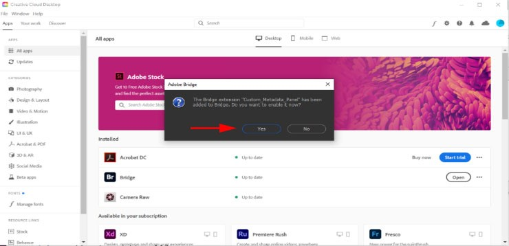

### **Accessing Bridge after Adding Extensions**
1.	After the extensions are successfully downloaded and installed, open Adobe Bridge again. When you open Adobe Bridge, you will be prompted with the following message. Click **Yes** for all prompts. 

2.	When complete, the following new items should appear in Window>Extensions…:
	-	Custom Metadata Panel
	-	Custom Metadata Panel – View Editor
