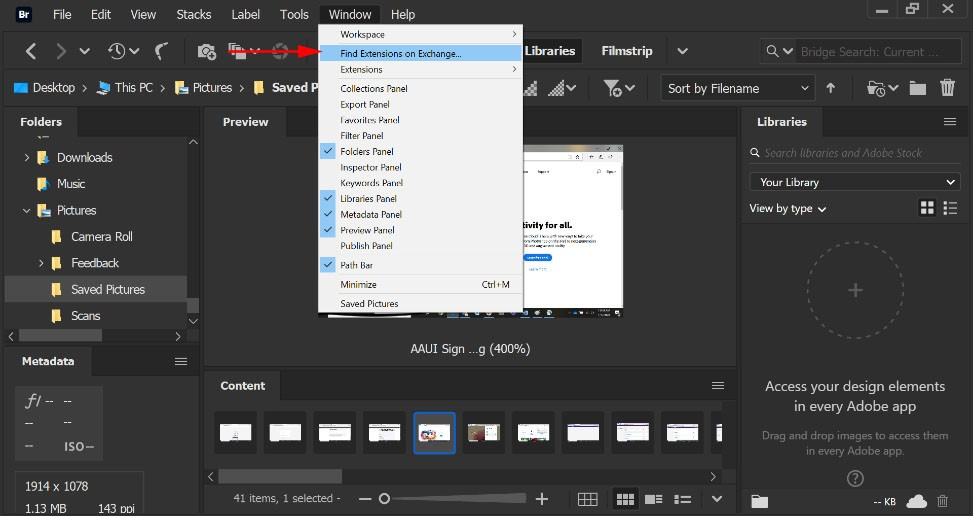
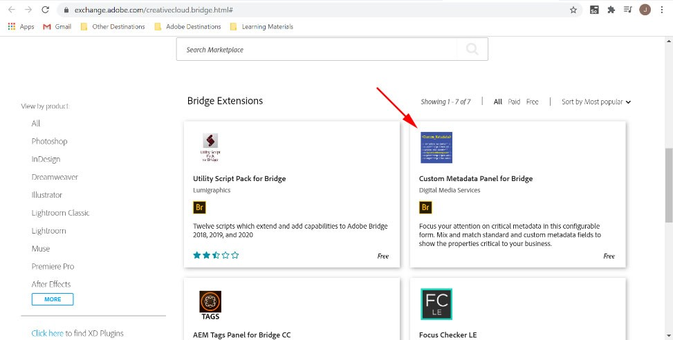
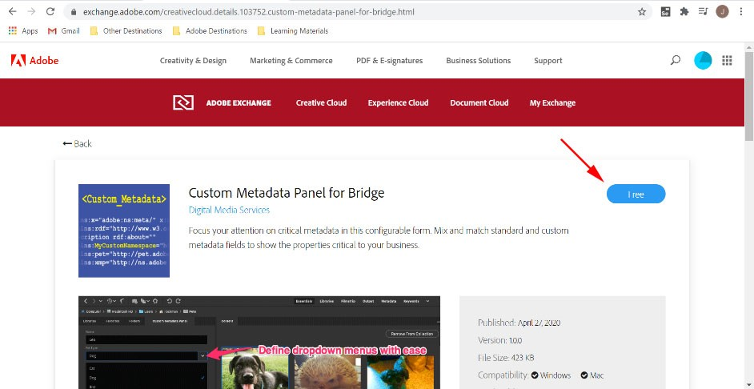

### **Adding the Custom Metadata Panel** 
1.	In Adobe Bridge, Photoshop or Illustrator, click on the Window tab and then click on **Find Extensions on Exchange…** Alternatively, you can visit the [Adobe Exchange directly](https://exchange.adobe.com/creativecloud.bridge.html).

2.	Search for "Custom Metadata" or scroll down and click on **Custom Metadata Panel**.

3.	Navigate to this page and click the "Free" button to install.

4.	Accept the License Agreement by clicking **Accept and Continue**.

5.	Creative Cloud will install the extension on your computer in a few moments. You will need to relaunch Bridge to see the extension.

Using Exchange ensures that you always have the latest version of the Custom Metadata Panel installed. However, some Enterprise customers may need to managed deployments differently. See [Troubleshooting](troubleshoot-install.md) for further guidance.
