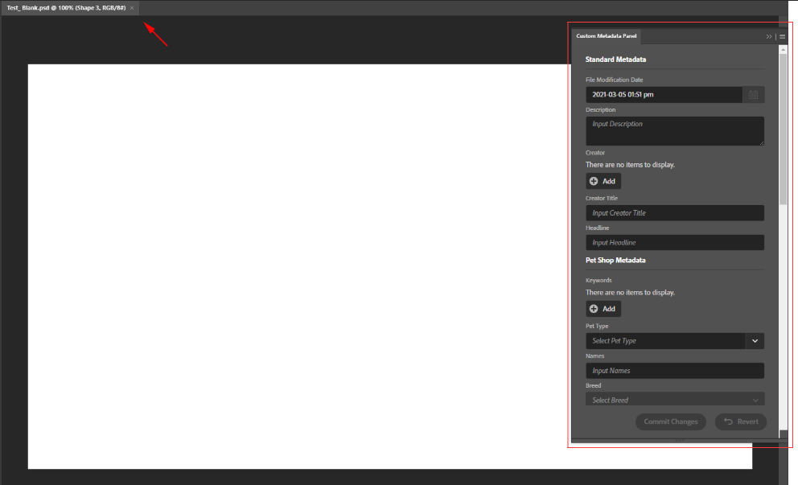
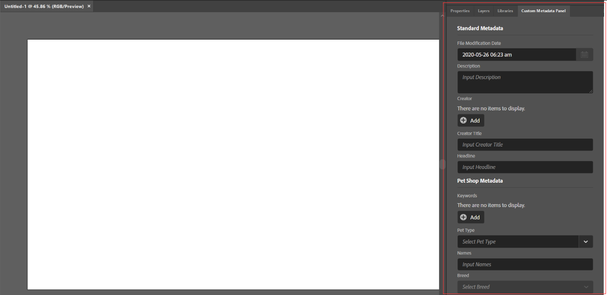

The Custom Metadata Panel is now available in Photoshop and Illustrator! Both instances of the Custom Metadata Panel have the same basic functionality as the one in Adobe Bridge. To access the panel, click **Window > Extensions > Custom Metadata Panel**.

Once complete, users will have:
- A Custom Metadata tab on the right-hand side of the Photoshop workspace.
    - To activate the Custom Metadata Panel in Photoshop, users will need to save a new file or open an existing file.
    - You can detach the tab and make it free-floating by dragging the tab out to the workspace.
- A free-floating, pop-out panel in the Illustrator workspace.
    - When launched, the Custom Metadata Panel is already active.
    - The pop-out panel can become fixed by dragging it into the panel on the right-hand side of the screen.

**Custom Metadata Panel in Adobe Photoshop:**

**Custom Metadata Panel in Adobe Illustrator:**

