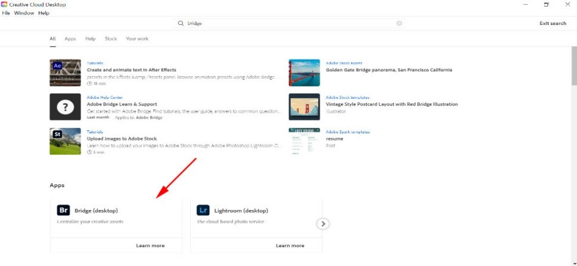
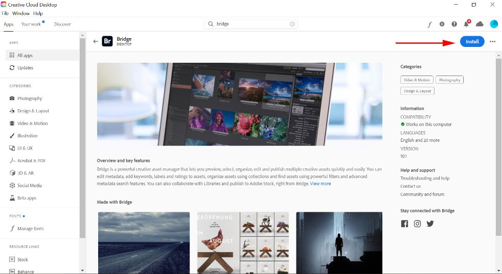
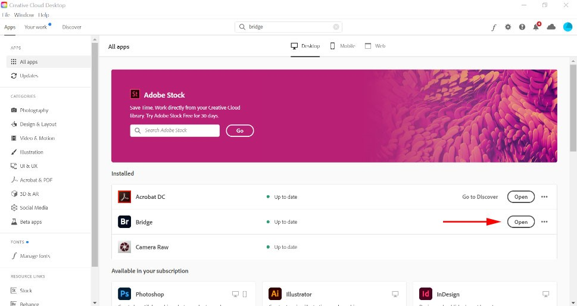
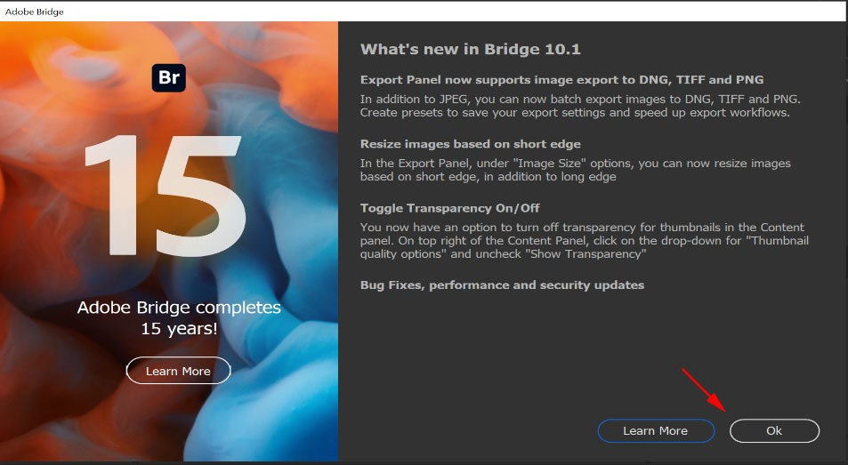

### **Installing Adobe Bridge**
1.	Open the Adobe Creative Cloud desktop app and search for Adobe Bridge. 
	-	If prompted, sign in with the email you use to log in to Adobe Creative Cloud.

2.	Click **install**. Follow the prompts and enter your computer's login credentials, if required.

3.	Open Adobe Bridge. You can double-click on the icon in your Applications/Programs folder, or you can navigate back to Creative Cloud app and click the button to open Bridge. 

4.	Your first launch experience includes a welcome message. Read and then click **OK**. 

