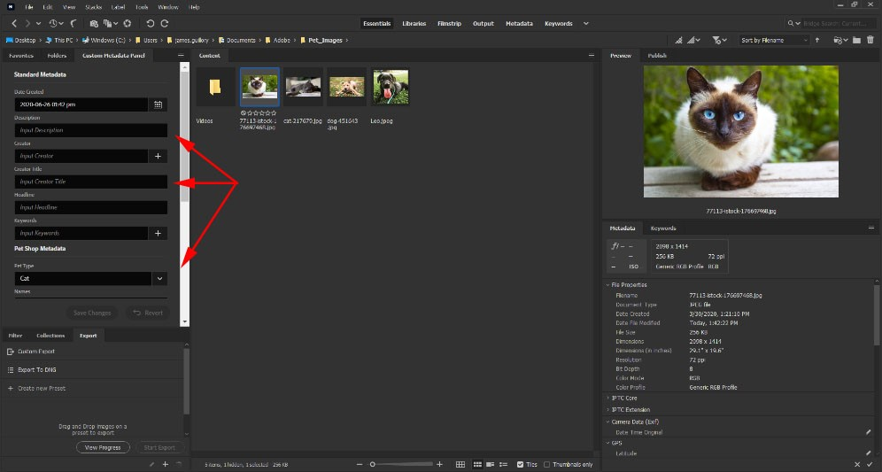
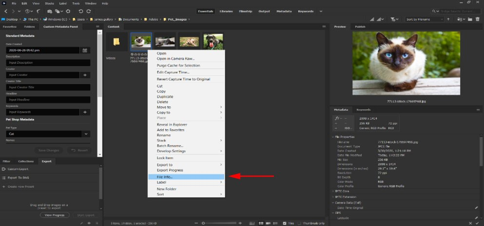

### **Managing Metadata**

1.	When you select an image, the Custom Metadata Panel on the left-hand side of the screen should populate with several fields. These fields are alterable via the [View Editor](https://github.com/adobe-dmeservices/custom-metadata/wiki/Using-the-View-Editor) and can be used to define distinct data on a specified image. 

	- ***Important Note:** While Bridge provides a set of predefined forms in the built-in Metadata Panel (seen on the right below), users can configure the Custom Metadata panel to consolidate metadata fields from several of the Bridge forms, or introduce completely new metadata schemas to Bridge. See the [View Editor](https://github.com/adobe-dmeservices/custom-metadata/wiki/Using-the-View-Editor) section for more details.*

    

2.	Users view, modify and enter new metadata via these fields. Based on the View settings, certain fields may be read only. Others may be required before a user can submit changes. Others may require data be present in another field in order for them to activate. There are many options, which are covered in the [View Editor](https://github.com/adobe-dmeservices/custom-metadata/wiki/Using-the-View-Editor) section below.

	The following form field types are supported:
	-	**Text (single- and multi- value)**
		-	Text fields allow users to enter freeform text.
	-	**Date**
		-	Date fields include a date and time picker. Users can enter date and time as freeform text as well. The form will attempt to conform the freeform text to a date formatted value. Users can use relative terms such as "yesterday" and "three weeks from now," as well as "2 days ago" and "45 min from now." If the field needs to adjust the formatting, it will highlight the value in a red border, alerting the user that it has made a formatting change. When the user submits the change, the form will include a warning indicator that it has changed the formatting. The next time you view the file, the formatting will be correct.
	-	**Dropdown  (single- and multi-value)**
		-	Dropdown fields have a defined set of values. Users choose values from a dropdown menu. The form allows you to include friendly text as well as the specific value, so that users can more easily locate choices. Dropdown fields allow users to type in the field, which will reduce the choices to matching values. Users can navigate the dropdown with their arrow keys, and then hit **Enter** or **Return** when they arrive at their choice.
	-	**Constrained value fields (Tags)**
		-	Tags are similar to text fields, however their values are constrained to specific values. Users can type in the field and all matching predefined values will appear below the field, similar to a dropdown. Users can see all available tags by typing and deleting everything in the field. Users can apply multiple tags to a file.
	-	**AEM Tags**
		-	AEM Tags is a special kind of tag. Adobe Experience Manager (AEM) includes a hierarchical tagging architecture for assets, and this form mirrors its functionality. Admins must configure it using specially formatted JSON that is available to them in their AEM instance. Users can navigate the hierarchy of tags and select one or more tags. Users can also type to filter available tags. Once applied, these tags will appear in the Tags field of the Metadata Detail page for the asset, once the asset is ingested into AEM.

3.	You can now edit the values in the form. As you make changes, the form will highlight those changes with green borders or green checkmarks. When you are satisfied with the changes that you have made to the file's metadata, click **Save Changes**. If you have made changes and then are dissatisfied with these changes, then you can click **Revert**. This changes the metadata back to the previous save state.
	- ***Important Note:** If you deselect your file or select another file, the Custom Metadata panel will warn you and ask if you want to commit your changes before changing the selection.*

4.	To validate changes or to view the entire XMP metadata record for a file, you can right click on an image and choose **File Info…**. You can also select the file and choose **File>File Info…** or use the keyboard shortcut **cmd/ctrl - i**.

	
