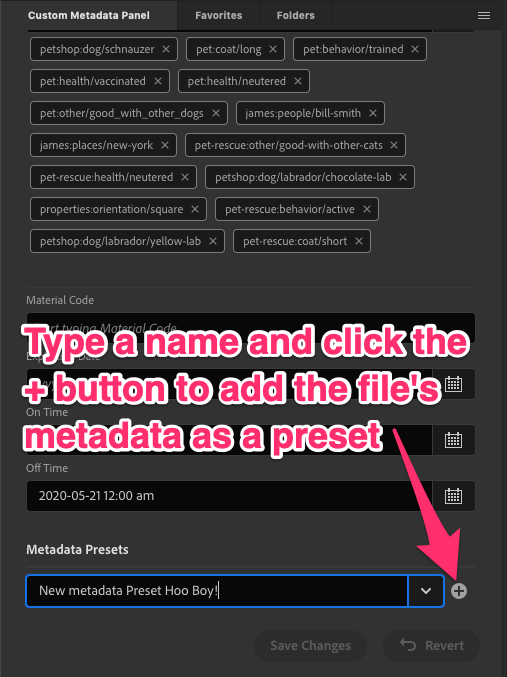
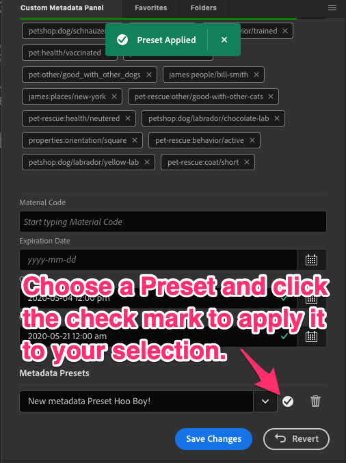

### **Metadata Presets**
1.	The Custom Metadata panel includes the ability to store a file's metadata as a **Metadata Preset** and apply it to other files. This is a handy tool if you have specific values you need to apply to a large set of assets. This capability is similar to Bridge's built-in Metadata Templates, which are found in the Tools menu. A key difference is that the Presets in the Custom Metadata Panel can include metadata that Bridge's Templates cannot see, as they are governed by the File Info panel.

	When you create a Metadata Preset, all of the fields with values in the current View will be added to the Preset. No other metadata will be included in the Preset. You can then apply those values to other assets.

2.	To create a Metadata Preset, select an asset, then type a name for the Preset in the Metadata Preset field at the bottom of the panel. Once finished, click the **+** button to add your Preset to the list. You may need to scroll up to see the Presets, as they are at the very bottom of the window.

	

3.	To apply a Metadata Preset, select one or more assets and choose a Preset from the Metadata Preset Dropdown at the bottom of the panel. The fields that will change or get new metadata values will turn green. The Metadata Preset tool will override existing metadata in files, so check to ensure that you are not replacing important information. For safety, these new values will not be applied until you click **Save Changes**. 

	
