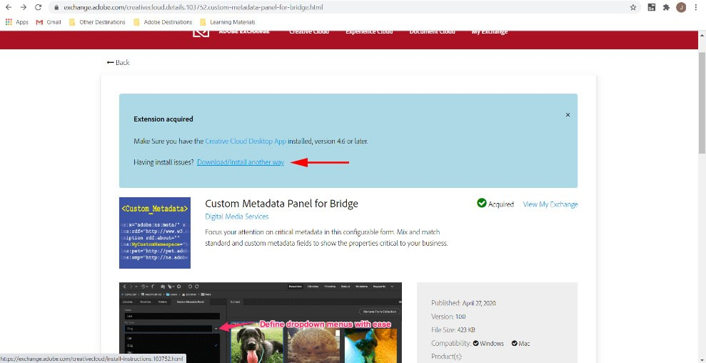
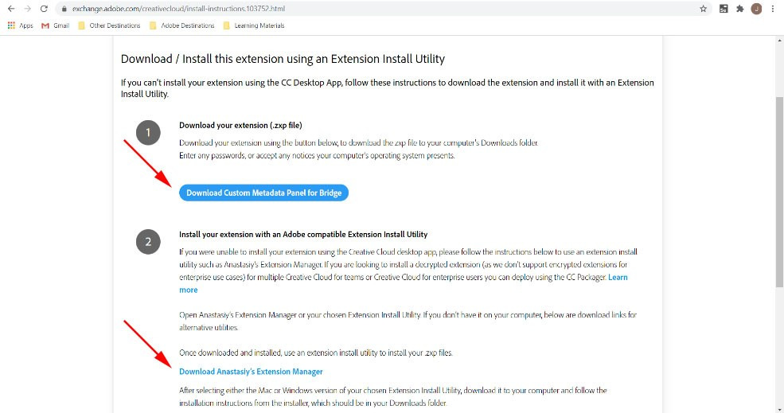
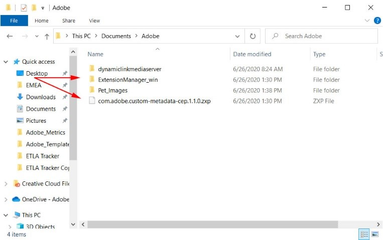
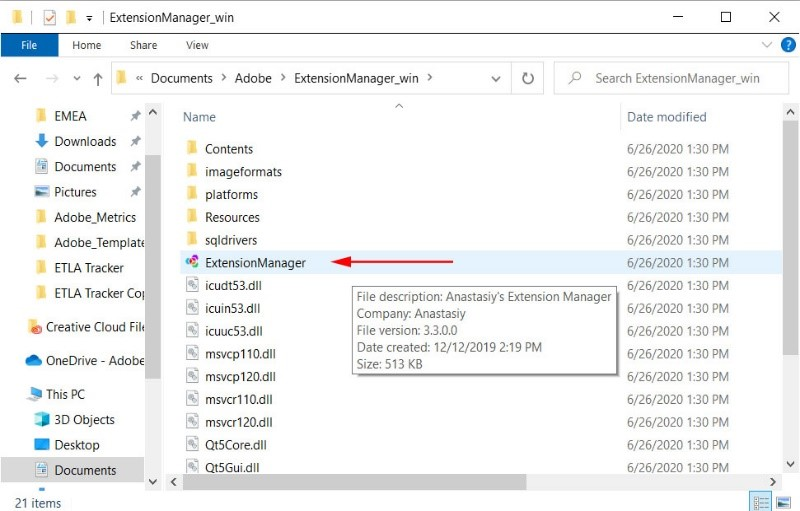
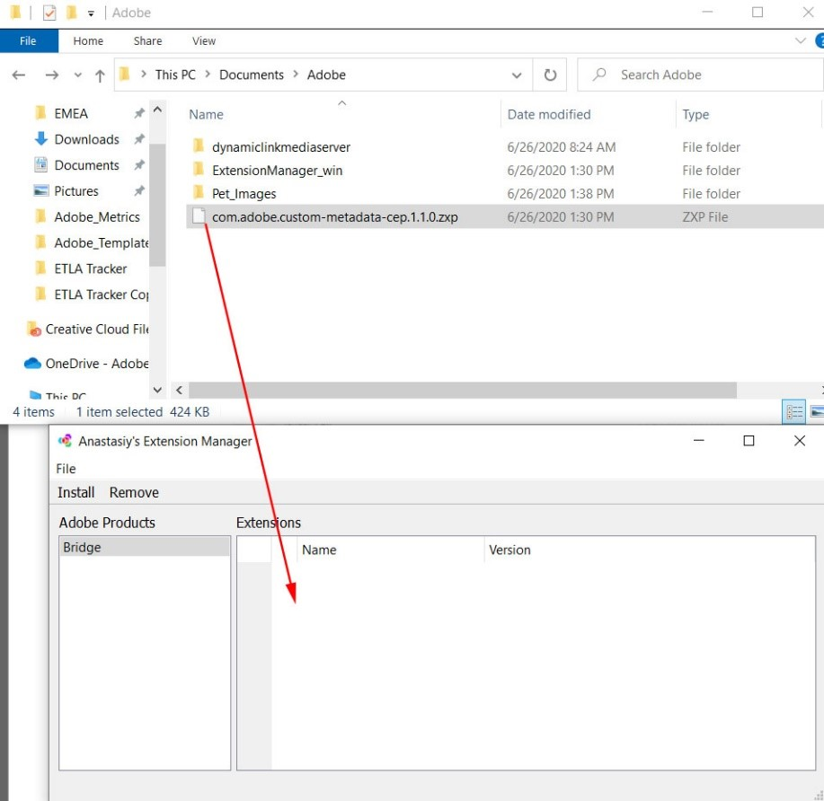
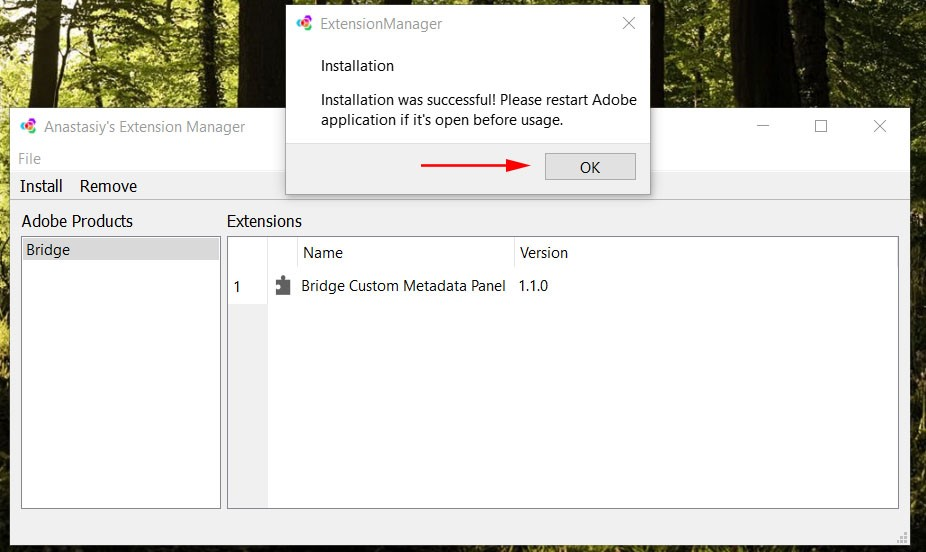
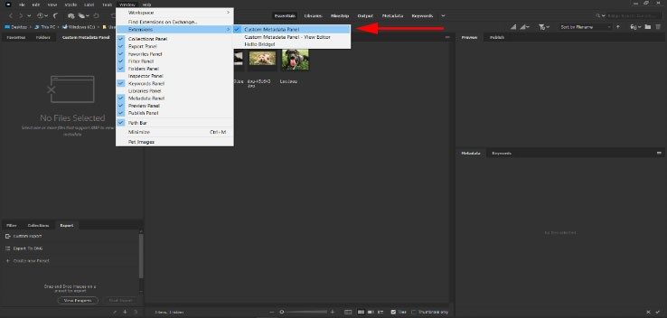

### **Troubleshooting Common Installation Issues**
***Enterprise Admins can now include this and other free extensions when they create Managed Packages in the Admin Console. [Read the Help Documentation here.](https://helpx.adobe.com/enterprise/using/create-nul-packages.ug.html#Managedpackages)*** Search for Custom Metadata Panel during step 7 in those instructions to include it and other Extensions in your Managed Package.

1.	If you have already installed the extension but the Custom Metadata Panel options are not available, please **quit Adobe Bridge** and then navigate to https://exchange.adobe.com/creativecloud.details.103752.custom-metadata-panel-for-bridge.html and click **Download / Install another way**. 

2.	Download the .zxp file and Anastasiy’s Extension manager.
	-	Obtain the .zxp file by clicking **Download Custom Metadata Panel for Bridge**
	-	Obtain the Anastasiy’s Extension manager by clicking [Download Anastasiy’s Extension Manager](https://install.anastasiy.com).

3.	Create a folder on your desktop to hold both files. Extract the ZIP archive for Anastasiy's Extension Manager to this folder. Place the ZXP in the folder as well.

4.	Drill into the Extension Manager folder and run the Extension manager.

5.	Drag the downloaded zxp into the Extension Manager or and click **Yes** when prompted to install. You can also select **Bridge** from the **Adobe Products** column and then click the **Install** link above the Adobe Products column. Browse to the ZXP and select it to install.

6.	You’ll see this dialog when finished. Click **OK** to proceed. 

7.	Now launch Bridge again. You should see **Custom Metadata Panel** and **Custom Metadata Panel – View Editor** as new extensions. To check this, click on the **Window** tab, then click **Extensions**. 
	-	Choose **Custom Metadata Panel** to launch the extension.

