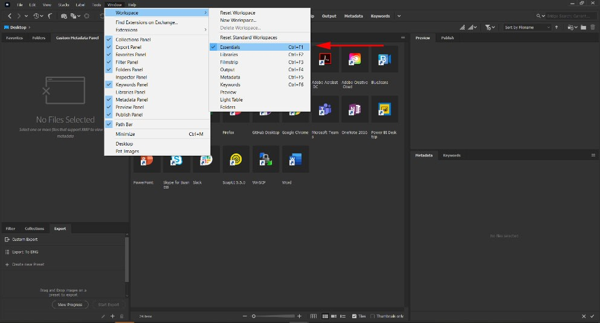
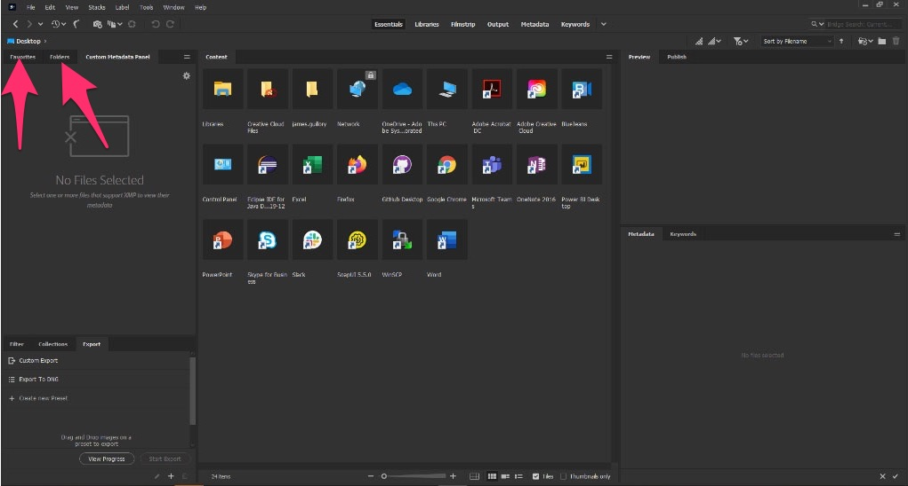

### **Using Bridge with the Custom Metadata Panel**

1.	In this manual, we use the **Essentials** Workspace in Bridge. Please change your workspace to **Essentials** by clicking on **Window -> Workspaces -> Essentials**.

2.	Bridge has many ways to navigate a folder structure to interact with files and folders. You can search, create Collections and Smart Collections, or drill down through a folder structure on your hard drive or mounted file system. The Custom Metadata Panel works on selected files. To use the Custom Metadata Panel, bring some files into focus however you like, and then select one or more of the files. For convenience, the Favorites and Folders tabs are good starting points for navigting your hard drive.

